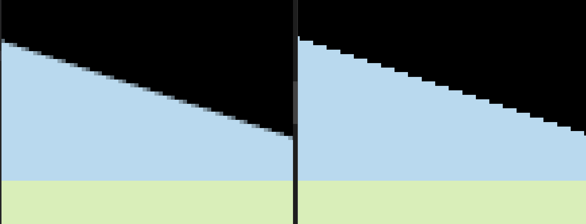

1. 开启msaa之后的结果对比
   
2. 作业中提示说每个像素都应该有自己的sample list来维护一个像素中的采样点的深度值，以及颜色值，但是这样的话需要将depth_buffer和frame_buffer扩大了4倍，我是用的是将一个像素上的**多个采样点**的深度都共用这个**像素**的深度，这样的话可以减轻边界上的锯齿。但是忽略了这种情况: 像素中心点采样时，三角形t2上的像素(x,y)可能在三角形t1上的像素(x,y)之后，但是super sampling之后，像素上有部分采样点又在三角形t1之前，也就是说t2上的像素部分在t1之前，部分在t1之后，这种情况下按照中心点来确定。这样处理最多只影响交叉的那一个像素值，但是可以节省3/4的存储空间。

   