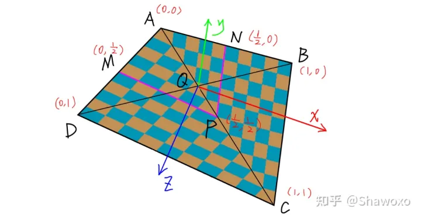
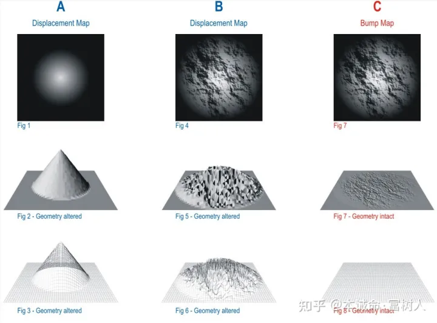

# 1. 关于透视矫正的问题
1. 由于计算中心坐标使用的是已经投影到屏幕空间的顶点坐标，所以插值出来的坐标可能与真实坐标不相同(例如重心投影后的位置，和通过投影后再插值出的位置不一致)

    ```C++
        float Z = 1.0 / (alpha / v[0].w() + beta / v[1].w() + gamma / v[2].w()); //计算出深度值
        float zp = alpha * v[0].z() / v[0].w() + beta * v[1].z() / v[1].w() + gamma * v[2].z() / v[2].w();
        zp *= Z;
    ```

2. 总之通过三角形屏幕空间的重心坐标计算，在透视投影之前的重心坐标
    ```c++
    auto[alpha, beta, gamma] = computeBarycentric2D(x, y, t.v);
    ```
    以上传入的是屏幕空间的x，y，以及投影到屏幕空间的三角形，计算出来的是在屏幕空间的重心坐标(已经透视投影之后) $\alpha' \  \beta' \ \gamma'$,真正插值应该使用三角形内的点在世界空间中的重心坐标$\alpha \  \beta \ \gamma$,而这个转换公式就是 
    $$
        \alpha = \frac{Z}{Z_B}\cdot \alpha' \\
        \beta = \frac{Z}{Z_B}\cdot \beta' \\
        \gamma = \frac{Z}{Z_B}\cdot \gamma' \\
    $$
    Z通过$\alpha \ +\  \beta \ +\ \gamma\ = 1$计算出来
    
    推导过程(trick目前没看懂为什么这样能推出来)：https://blog.csdn.net/Motarookie/article/details/124284471
    https://zhuanlan.zhihu.com/p/403259571 (有正规推导过程)
3. 通过透视投影，**三角形的Z坐标其实存储在齐次坐标的w项中** 
4. 计算出来的重心坐标可以用来**插值任何属性**

# 纹理
1. GPU中的一块内存，可以进行范围查询(mipmap)，这块内存中的数据可以用来参与像素/fragment的计算，是像素点的属性值，概念不仅仅局限于是一张图
2. 环境贴图：环境光的贴图(包括直接光和间接光)可以用来进行渲染物体
3. Spherical Environment Map：环境光记录在球上，展开成矩形
4. normal/bump mapping改变法线，，**不增加更多三角形(不增加模型复杂度)的情况下，增加表面细节**，从而增加表面细节，通过纹理指定物体表面的相对移位来计算出一个**法线**，通过这个法线(而不是这个点原来的法线)来shading，可以用来添加表面的细节 LearnOpenGL上有教程(https://learnopengl-cn.github.io/05%20Advanced%20Lighting/04%20Normal%20Mapping/)
5. displacemnet mapping： 通过纹理指定物体表面的相对移位来计算出一个**新的法线和新的位置**，通过这个**新的法线和新的位置**(而不是这个点原来的法线)来shading，可以用来添加表面的细节，需要模型足够细，
6. displacement mapping 和 bump mapping的区别
    
    位移贴图（Displacement Map）和凹凸贴图（Normal Map）都是常见的用于增强模型表现力的贴图技术，但它们的原理和应用场景有所不同。

    位移贴图是一种可以**改变模型几何形状的贴图技术**，其原理是根据灰度值信息，调整每个像素点的位置，从而使得模型表面的几何形状发生变化。位移贴图的制作需要较高的模型细度和纹理分辨率，且需要使用能够对位移贴图进行支持的引擎或渲染器进行渲染。位移贴图可以用于表现高精度的细节和曲面变形，但对计算机的性能要求较高，因此通常用于制作高质量游戏或电影等领域。

    凹凸贴图是一种常见的在游戏中使用的表面细节增强技术，通过**给模型表面赋予不同的颜色值来模拟每个像素点的法线向量信息**，从而使得模型表面看起来更加精细。凹凸贴图通常使用RGB颜色通道来表示模型表面的法线向量信息，即将模型表面的法线方向和光照方向进行映射，从而获得每个像素点的颜色值，使得模型表面看起来具有凹凸感。相比于位移贴图，凹凸贴图制作难度较低，且对计算机性能要求较低，通常被广泛应用于游戏等实时渲染场景。但凹凸贴图只能模拟模型表面的法线向量信息，对于模型几何形状的改变无能为力，因此其表现能力相对较弱。
7. 算法：


# 作业相关
1. 计算相机空间空间中的法线，为什么要计算它，以及怎样计算它
   ```C++
        std::array<Eigen::Vector4f, 3> mm {
                (view * model * t->v[0]),
                (view * model * t->v[1]),
                (view * model * t->v[2])
        };

        std::array<Eigen::Vector3f, 3> viewspace_pos;

        std::transform(mm.begin(), mm.end(), viewspace_pos.begin(), [](auto& v) {
            return v.template head<3>();
        });
   ```
   原因就是这样处理在shading时就不需要传入相机位置了，相机位置是(0,0,0), 但是由与使用的是**相机空间(投影之前)**,所以需要先将三角形的法线和顶点变换到相机空间中(投影前)
   其实完全可以在shading时传入相机的位置，这样根据三角形原来的顶点位置和法线插值出来的1. 位置和 2. 法线以及3.传入的相机位置就可以计算出该着色点的颜色，但是光栅化类需要知道相机的位置，所以我判断这么转一圈将顶点和法线转换到相机空间，是因为光栅化器只保存了model，view，projection而不包含相机位置，但是相机位置隐式通过model和view进行利用(具体就是将法线和顶点变换到相机空间，这样相机的位置就在(0,0,0)了)
2. 双线性插值适用情况是纹理的分辨率过小，导致多个pixel会映射到同一个texel上，使用插值能够让纹理映射到物体表面变化更平滑，而没有很硬的分界