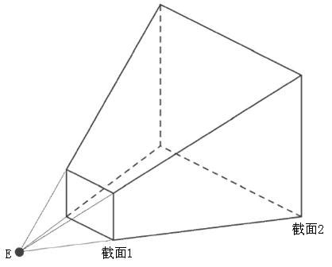
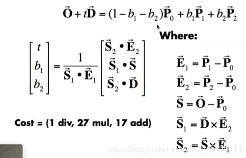
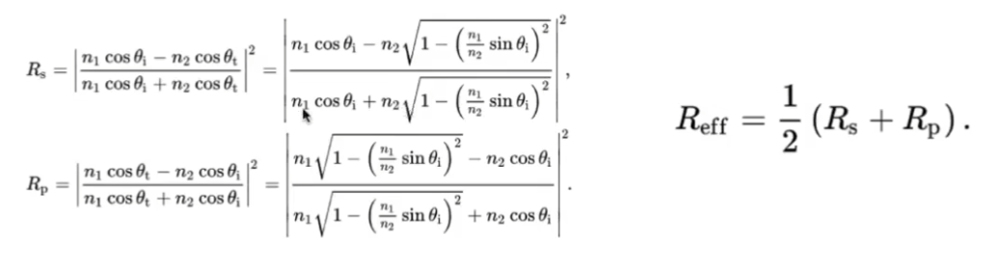

1. 计算cast ray
    
    计算cast ray就是光栅化中投影的步骤倒着走：首先Mview_port的逆变换，其次将经典立方体的**近平面投射到原来位置即可**，因为光线投射出去只需要知道两点就能确定一条光线(相机位置(起点)和光线打到近平面上的一点)
    1. view_port逆变换就是将frame_buffer中的像素位置，转换回对应的近平面的位置
        ```C++
        float scale = std::tan(deg2rad(scene.fov * 0.5f));
        float imageAspectRatio = scene.width / (float)scene.height;
        for (int j = 0; j < scene.height; ++j){
            for (int i = 0; i < scene.width; ++i){
                //计算从像素点(i,j)打出去的光线在近平面的位置坐标x，y
                float x = ((i+0.5)/ scene.width * 2) - 1; //屏幕坐标 i，j 转换回在经典立方体中近平面的坐标x，y
                float y = ((j+0.5)/scene.height * 2) - 1;
                //投影回相机的视锥中的长宽比
                x *= imageAspectRatio;   // 此时 [-1, 1]^2 投影回视锥时x比y多一个缩放比例imageAspectRatio
                x *= scale * zNear;
                y *= scale * zNear;      //scale * zNear是整个截面在视锥中一个缩放倍数，随着截面上的坐标x，y也随截面进行缩放，所以需要乘上
            }
        }
        ```
2. 三角形求交:
   三角形求交，moller公式
   作业中使用 u,v来表示b1,b2

3. 关于反射和折射的代码:(其中的所有传入光线的方向都是物理意义上正确的方向, 比如入射到p点的方向就是从发出点到p点,而不是反过来的方向)
    
   1. 反射
    ```C++
    case REFLECTION:
        {
            //通过fresnel项来计算出光线在这一点的能量有多少发生了反射,占比为kr,根据能量守恒定律可以计算出折射能量的占比为kt = 1 - kr (transmit)
            float kr = fresnel(dir, N, payload->hit_obj->ior);
            Vector3f reflectionDirection = reflect(dir, N);
            Vector3f reflectionRayOrig = (dotProduct(reflectionDirection, N) < 0) ?
                                        hitPoint + N * scene.epsilon :
                                        hitPoint - N * scene.epsilon;
            hitColor = castRay(reflectionRayOrig, reflectionDirection, scene, depth + 1) * kr;
            break;
        }
    ```
    2. fresnel
    ```C++
    // I incident view direction
    float fresnel(const Vector3f &I, const Vector3f &N, const float &ior)
    {
        float cosi = clamp(-1, 1, dotProduct(I, N));
        float etai = 1, etat = ior;             
        if (cosi > 0) {  std::swap(etai, etat); }
        // Compute sini using Snell's law
        float sint = etai / etat * sqrtf(std::max(0.f, 1 - cosi * cosi));
        // Total internal reflection
        if (sint >= 1) {
            return 1;
        }
        else {
            float cost = sqrtf(std::max(0.f, 1 - sint * sint));
            cosi = fabsf(cosi);
            float Rs = ((etai * cosi) - (etat * cost)) / ((etai * cosi) + (etat * cost));
            float Rp = ((etat * cosi) - (etai * cost)) / ((etat * cosi) + (etai * cost) );
            
            return (Rs * Rs + Rp * Rp) / 2;
        }
        // As a consequence of the conservation of energy, transmittance is given by:
        // kt = 1 - kr;
    }
    ```
    3. 折射项与反射相似