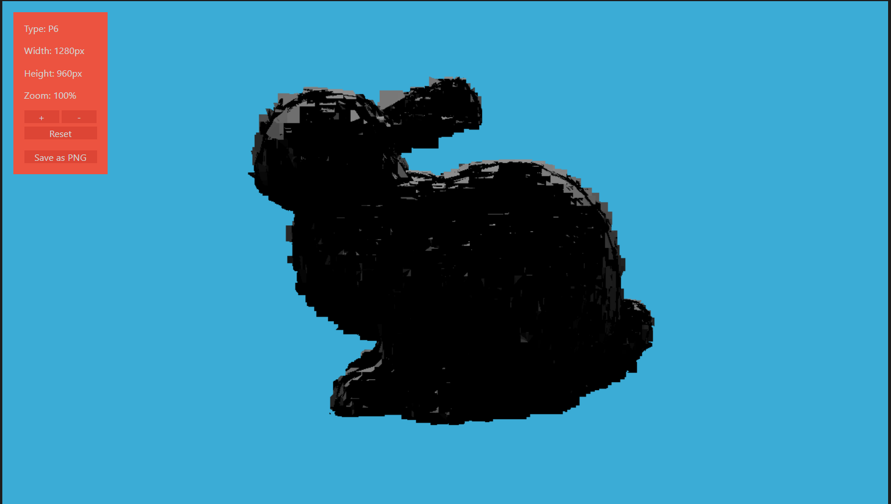
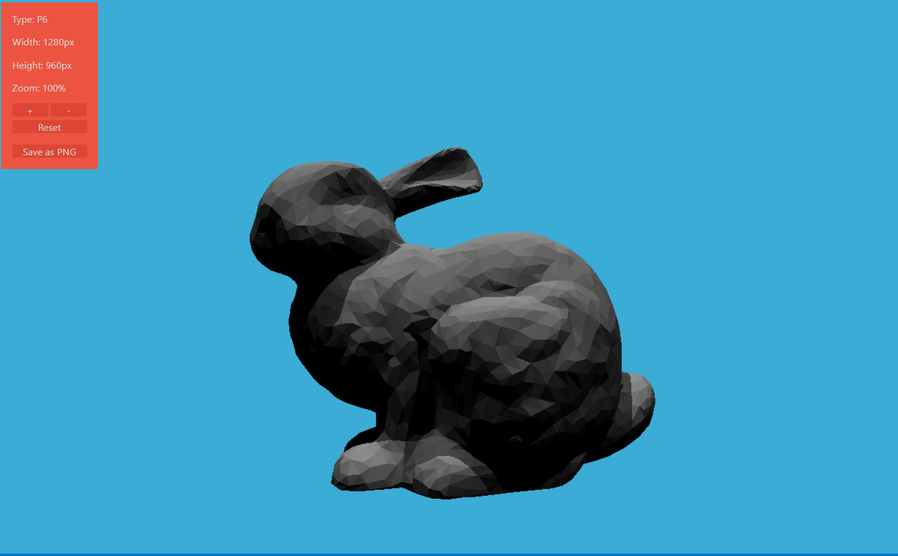
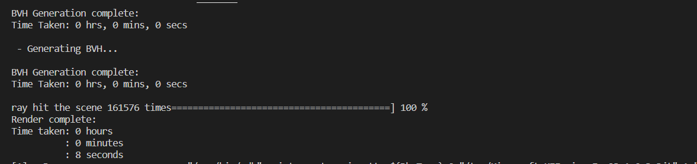
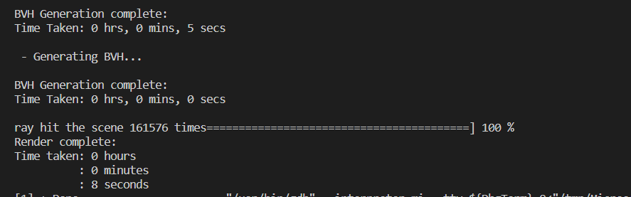
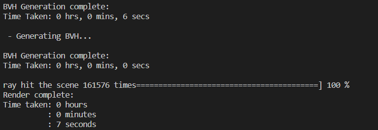

1. 关于BVH
2. 基于图元划分的空间索引结构的有几个重要性质：

   每一个图元在整个结构中只会出现一次。但是同一块空间区域可能会被多个节点所包含。
   基于图元划分的空间索引结构消耗内存的上限是已知的。若每一个节点仅包含两个子节点，叶节点只存储一个图元，所有非叶节点的度都为 
   ，则总结点的个数为 
   （ 
   个叶节点， 
   个非叶节点，二叉树的性质）。

   划分时要尽可能减少划分后两部分包围盒重叠的体积，因为**重叠的体积越大，Ray穿过重叠区域的可能性越大**，**遍历两个子树的可能性就越高**，计算消耗越多。
   因为我们最终的目的是要减少划分后左右子节点重叠的体积，因此一般在图元跨度最大的坐标轴上进行划分。这里，图元的跨度可以用图元的包围盒来衡量也可以用图元的质心来衡量。

   取自 https://zhuanlan.zhihu.com/p/50720158
3. 不仅可以对场景构建BVH，也可以对复杂的模型构建BVH，例如MeshTriangle中就构建了一个BVH
4. Scene::getIntersection() ---> BVHAccel::getIntersection() ---> Object::getIntersection() ---> MeshTriangle::getIntersection() ---> Triangle::getIntersection()
5. 在Triangle实现的getIntersection为什么噪声特别大？
   

    使用原框架中的moller算法却能得到好的结果
   
   ```C++
   inline Intersection Triangle::getIntersection(Ray ray){
      ......
      inter.happened = true;
      inter.distance = t_tmp;
      inter.coords = ray(t_tmp);
      inter.m = m;
      inter.obj = this;
      inter.normal = normal;   
   }
   ```
6. Bounds::ItersectP()实现，光线与BBox相交的条件是  t_exit > t_enter光线在盒子中“传播了一段时间”，并且离开时“时间为正” t_exit >0;
   ```C++
   inline bool Bounds3::IntersectP(const Ray& ray, const Vector3f& invDir,
                                const std::array<int, 3>& dirIsNeg) const
   {
      // invDir: ray direction(x,y,z), invDir=(1.0/x,1.0/y,1.0/z), use this because Multiply is faster that Division
      // dirIsNeg: ray direction(x,y,z), dirIsNeg=[int(x>0),int(y>0),int(z>0)], use this to simplify your logic
      // TODO test if ray bound intersects
      float t_enter = std::numeric_limits<float>::min();
      float t_exit = std::numeric_limits<float>::max();


      //t1，t2 的x，y，z分别是进入pMin和pMax所在的三个平面的时间t
      Vector3f t1 = (pMin - ray.origin)  * invDir; 
      Vector3f t2 = (pMax - ray.origin) * invDir;
      
      t_enter = std::max(t_enter, std::min(t1.x, t2.x)); //std::min(t1.x, t2.x)表示进入垂直于x平面的较小的t
      t_enter = std::max(t_enter, std::min(t1.y, t2.y));
      t_enter = std::max(t_enter, std::min(t1.z, t2.z));
      
      t_exit = std::min(t_exit, std::max(t1.x, t2.x));
      t_exit = std::min(t_exit, std::max(t1.y, t2.y));
      t_exit = std::min(t_exit, std::max(t1.z, t2.z));   
      
      return t_exit > 0 && t_exit >s t_enter;
   }
   ```
5. SAH加速结构
      
      
   1. 核心思想就是：改进BVH，不只是考虑使用中间物体将场景划分为物体数量相等的两部分，而且也要考虑面积，查询当前BVH节点的总Cost为 Cu,它就查找等于两个子节点的Cost乘以各自的概率，再加上当前节点其余部分的Cost，可以用分割后的两个集合A，B的包围盒表面积与当前节点包围盒的面积的比值作为概率
   2. SA, SB与包围盒的大小相关，CostA CostB与子节点的数量有关，所以S和Cost相乘就是考虑到了**划分物体的数量**以及**划分之后包围盒的相对大小**(包围盒太大的话cost会更大)
6. 对比
   1. 使用BVH
   2. 使用SAH，分割点可能为任意一个物体，时间复杂度O(n^2)
   3. 使用SAH，分割点只能是group的边界(也就是其他文档上所说的bucket), 时间复杂度 O(nk)k为bucket的数量